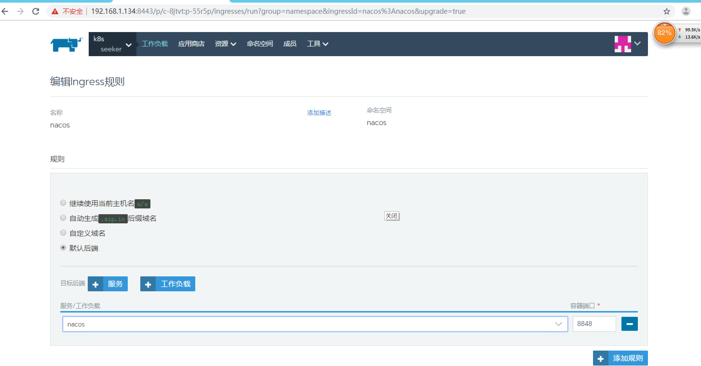

# Kubernetes Nacos

 本项目是基于官方的nacos-k8s，其中增加实现ingress的访问，而非通过curl来注册，因为在实际使用中配置中心不可能通过命令方式来注册全部内容，故而需要通过http请求的方式来进行UI界面的操作！

# 高级使用

> 在高级使用中,Nacos在K8S拥有自动扩容缩容和数据持久特性,请注意如果需要使用这部分功能请使用PVC持久卷,Nacos的自动扩容缩容需要依赖持久卷,以及数据持久化也是一样,本例中使用的是NFS来使用PVC.
>

## 部署 NFS

* 创建角色、`ServiceAccount`、NFS StorageClass、部署`NFS-Client Provisioner`

```shell
cd ./nfs/fat
kubectl create -f ./
```

* 验证NFS部署成功

```shell
kubectl get pod -l app=nfs-client-provisioner
```

## 部署数据库

* 部署主库

```shell

cd nacos/fat

kubectl create -f mysql/mysql-master-nfs.yaml
```

* 部署从库

```shell

cd nacos/fat

kubectl create -f mysql/mysql-slave-nfs.yaml
```

* 验证数据库是否正常工作

```shell
# master
kubectl get pod 
NAME                         READY   STATUS    RESTARTS   AGE
mysql-master-gf2vd                        1/1     Running   0          111m

# slave
kubectl get pod 
mysql-slave-kf9cb                         1/1     Running   0          110m
```

## 部署Nacos

* 修改  **depoly/nacos/nacos-pvc-nfs.yaml**

```yaml
data:
  mysql.master.db.name: "主库名称"
  mysql.master.port: "主库端口"
  mysql.slave.port: "从库端口"
  mysql.master.user: "主库用户名"
  mysql.master.password: "主库密码"
```
本例中无须修改，直接部署即可。

* 创建 Nacos

``` shell
kubectl create -f nacos-k8s/deploy/nacos/nacos-pvc-nfs.yaml
```

* 验证Nacos节点启动成功

```shell
kubectl get pod -l app=nacos

NAME      READY   STATUS    RESTARTS   AGE
nacos-0   1/1     Running   0          19h
nacos-1   1/1     Running   0          19h
```

* **测试**

  * **服务注册**

```bash
curl -X PUT 'http://cluster-ip:8848/nacos/v1/ns/instance?serviceName=nacos.naming.serviceName&ip=20.18.7.10&port=8080'
```

  * **服务发现**

```bash
curl -X GET 'http://cluster-ip:8848/nacos/v1/ns/instances?serviceName=nacos.naming.serviceName'
```

  * **发布配置**

  ```bash
  curl -X POST "http://cluster-ip:8848/nacos/v1/cs/configs?dataId=nacos.cfg.dataId&group=test&content=helloWorld"
  ```

  * **获取配置**

  ```bash
  curl -X GET "http://cluster-ip:8848/nacos/v1/cs/configs?dataId=nacos.cfg.dataId&group=test"
  ```

到这里你可以发现新节点已经正常加入Nacos集群当中

# 例子部署环境

- 机器配置

| 内网IP      | 主机名     | 配置                                                         |
| ----------- | ---------- | ------------------------------------------------------------ |
| 192.168.1.134 | k8s-master | CentOS Linux release 7.3.1611 (Core) Single-core processor Mem 4G Cloud disk 40G |
| 192.168.1.218 | node01     | CentOS Linux release 7.3.1611 (Core) Single-core processor Mem 4G Cloud disk 40G |
| 192.168.1.174 | node02     | CentOS Linux release 7.3.1611 (Core) Single-core processor Mem 4G Cloud disk 40G |

- Kubernetes 版本：**1.14.6** （如果你和我一样只使用了三台机器,那么记得开启master节点的部署功能）
- NFS 版本：**4.1** 在k8s-master进行安装Server端,并且指定共享目录,本项目指定的**/data/nfs-data**
- Git

# 限制

* 必须要使用持久卷,否则会出现数据丢失的情况

# 项目目录

| 目录 | 描述                                |
| ------ | ----------------------------------- |
| plugin | 帮助Nacos集群进行动态扩容的插件Docker镜像源码 |
| deploy | K8s 部署文件              |

# 配置属性

* nacos-pvc-nfs.yaml or nacos-quick-start.yaml 

| 名称                  | 必要 | 描述                                    |
| --------------------- | -------- | --------------------------------------- |
| mysql.master.db.name  | Y       | 主库名称                      |
| mysql.master.port     | N       | 主库端口                        |
| mysql.slave.port      | N       | 从库端口                       |
| mysql.master.user     | Y       | 主库用户名                     |
| mysql.master.password | Y       | 主库密码                     |
| NACOS_REPLICAS        | N      | 确定执行Nacos启动节点数量,如果不适用动态扩容插件,就必须配置这个属性，否则使用扩容插件后不会生效 |
| NACOS_SERVER_PORT     | N       | Nacos 端口             |
| PREFER_HOST_MODE      | Y       | 启动Nacos集群按域名解析 |

* **nfs** deployment.yaml 

| 名称       | 必要 | 描述                     |
| ---------- | -------- | ------------------------ |
| NFS_SERVER | Y       | NFS 服务端地址         |
| NFS_PATH   | Y       | NFS 共享目录 |
| server     | Y       | NFS 服务端地址  |
| path       | Y       | NFS 共享目录 |

* mysql 

| 名称                     | 必要 | 描述                                                      |
| -------------------------- | -------- | ----------------------------------------------------------- |
| MYSQL_ROOT_PASSWORD        | N       | ROOT 密码                                                    |
| MYSQL_DATABASE             | Y       | 数据库名称                                   |
| MYSQL_USER                 | Y       | 数据库用户名                                  |
| MYSQL_PASSWORD             | Y       | 数据库密码                              |
| MYSQL_REPLICATION_USER     | Y       | 数据库复制用户            |
| MYSQL_REPLICATION_PASSWORD | Y       | 数据库复制用户密码      |
| Nfs:server                 | N      | NFS 服务端地址，如果使用本地部署不需要配置 |
| Nfs:path                   | N     | NFS 共享目录，如果使用本地部署不需要配置 |


注：上述Nacos服务注册与配置时是通过curl命令来完成的，但在实际使用中配置中心不可能通过命令方式来注册全部内容，
故而需要通过http请求的方式来进行UI界面的操作，具体实现方法只需要在Rancher中找到项目所在的命名空间添加负载均衡，
即添加Ingress规则即可实现对外的访问，通过 http://192.168.1.218/nacos 或 http://192.168.1.174/nacos 即可访问。
如下图所示：



或通过nacos-ingress-fat.yaml脚本执行也同样效果。

另:其中nacos-pvc-nfs.yaml文件中
~~~bash
          readinessProbe:
            httpGet:
              port: client-port
              path: /nacos/v1/console/health/readiness
            initialDelaySeconds: 60
            timeoutSeconds: 3
          livenessProbe:
            httpGet:
              port: client-port
              path: /nacos/v1/console/health/liveness
            initialDelaySeconds: 60
            timeoutSeconds: 3
~~~
* 此处的健康检查如果开启，需要将时间延长，否则会造成别的应用无法注册成功报code:503 msg: 
server is STARTING now, please try again later!这样的错误。

参考地址：https://github.com/nacos-group/nacos-k8s/blob/master/README-CN.md
